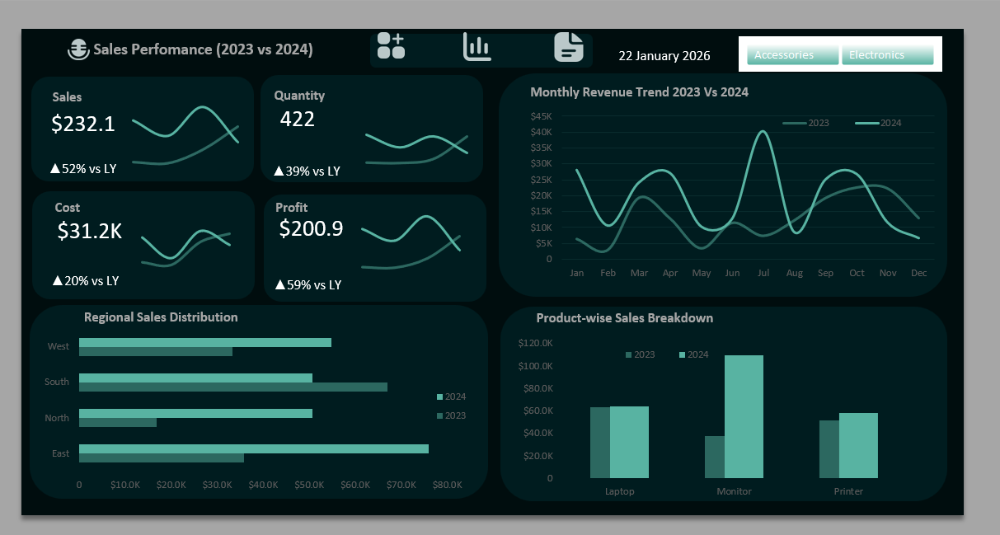

# Sales Performance Dashboard (2023 vs 2024) — Excel


---

## 🏢 1. Background & Business Context

A retail business operating across 4 regions (East, West, North, South) and 2 product categories (Electronics and Accessories) needed a clear answer to one question: **did the business actually grow in 2024 — and if so, where, what, and why?**

Without a structured view, leadership was making decisions based on gut feel. Total sales numbers looked good, but the breakdown by region, product, and month was buried in raw transaction logs.

A data analyst built an end-to-end Excel dashboard to answer:

- How did overall Sales, Profit, Cost, and Quantity change year-over-year?
- Which regions drove 2024 growth — and which fell behind?
- Which products are accelerating vs. declining?
- Is profit growing faster than revenue — or is cost eroding margins?
- What does the monthly trend reveal about seasonal demand patterns?

---

## 🗂️ 2. Data Structure

**Source:** Internal sales transaction records
**Volume:** 300 orders across 2023–2024

### Raw Data — `Raw_Data.xlsx`

| Column | Type | Description |
|---|---|---|
| `OrderID` | TEXT | Unique order identifier (ORD0001…) |
| `Date` | DATE | Transaction date |
| `Product` | TEXT | Laptop, Monitor, Printer, Mouse, Keyboard, Headphones |
| `Category` | TEXT | Electronics / Accessories |
| `Region` | TEXT | East, West, North, South |
| `Sales` | FLOAT | Revenue for the order |
| `Quantity` | INT | Units sold |
| `Cost` | FLOAT | Cost of goods for the order |

### Cleaned Data — `Cleaned_Data.xlsx`

Two additional columns engineered for analysis:

| Column | Logic | Purpose |
|---|---|---|
| `Month` | Extracted from Date | Monthly trend slicing (Jan–Dec) |
| `Year` | Extracted from Date | Year-over-year comparison (2023 vs 2024) |
| `Profit` | `Sales - Cost` (calculated in Pivot) | Margin tracking |

---

## 📌 3. Executive Summary

> **Period:** 2023 vs 2024 &nbsp;|&nbsp; **Orders:** 300 &nbsp;|&nbsp; **Tool:** Microsoft Excel

### Full-Year KPI Comparison

| Metric | 2023 | 2024 | YoY Change |
|---|---|---|---|
| 💰 Sales | $365,644 | $475,605 | **▲ +30.1%** |
| 📦 Quantity | 724 units | 899 units | **▲ +24.2%** |
| 🏭 Cost | $57,542 | $63,978 | ▲ +11.2% |
| 💵 Profit | $308,102 | $411,627 | **▲ +33.6%** |

### 💡 The Most Important Number

> **Profit grew 33.6% while Cost grew only 11.2%**
> This means the business did not just grow — it became **more efficient.**
> Every rupee of additional cost generated 3× more profit in 2024 than in 2023.

---

### 📸 Dashboard Preview



---

## 🔍 4. Insights Deep Dive

### Insight 1 — Profit Outpaced Revenue: Margins Are Expanding

**Data:** Sales +30.1% | Cost +11.2% | Profit +33.6%

Cost grew at less than one-third the rate of revenue. This is the single most important signal in the dataset — the business is not just selling more, it is **keeping more of what it sells.** Profit margin improved from 84.3% (2023) to 86.6% (2024), a structural improvement that compounds over time.

---

### Insight 2 — East Region Is the Fastest-Growing Market

**Data:**
| Region | 2023 Sales | 2024 Sales | YoY Growth |
|---|---|---|---|
| East | $61,995 | $121,472 | **▲ +95.9%** |
| West | $90,869 | $115,324 | ▲ +26.9% |
| South | $123,928 | $145,398 | ▲ +17.3% |
| North | $88,853 | $93,410 | ▲ +5.1% |

East nearly **doubled its sales** in a single year — growing from the smallest region to the second largest. This is not incremental growth; it signals a step-change in East region demand or distribution coverage. North, meanwhile, grew only 5.1% — the slowest region and a candidate for investigation.

---

### Insight 3 — Monitor and Mouse Are the Breakout Products of 2024

**Data:**
| Product | 2023 Sales | 2024 Sales | YoY Growth |
|---|---|---|---|
| Monitor | $37,447 | $109,494 | **▲ +192.4%** |
| Mouse | $42,009 | $105,919 | **▲ +152.1%** |
| Printer | $51,867 | $58,320 | ▲ +12.4% |
| Laptop | $63,550 | $64,330 | ▲ +1.2% |
| Keyboard | $87,038 | $55,920 | **▼ -31.2%** |
| Headphones | $83,733 | $81,621 | ▼ -2.5% |

Monitor and Mouse are not just growing — they are transforming the product mix. Keyboard, once the top-selling product, declined 31.2% — the only product with a significant negative swing. This suggests a potential market shift away from keyboards or a competitive pricing/availability issue.

---

### Insight 4 — Electronics Is Closing the Gap With Accessories

**Data:** Electronics: $152,865 (2023) → $232,145 (2024) — **▲ +51.8%**
Accessories: $212,779 (2023) → $243,460 (2024) — **▲ +14.4%**

Electronics grew at 3.6× the rate of Accessories. If this trajectory continues into 2025, Electronics will overtake Accessories as the primary revenue category — a fundamental shift in the product mix that should inform inventory, pricing, and marketing strategy.

---

### Insight 5 — South Remains the Revenue Anchor, but East Is the Growth Story

**Data:** South = $145,398 (highest absolute sales in 2024) | East = +95.9% YoY growth

South is stable and high-volume — the safe revenue base. East is volatile and high-growth — the expansion opportunity. A balanced portfolio strategy would protect South's volume while investing in East's momentum, rather than treating all regions equally.

---

## 🎯 5. Recommendations

| Priority | Recommendation | Insight Basis | Expected Impact |
|---|---|---|---|
| 🔴 **Critical** | Increase Monitor and Mouse inventory and promotional spend for 2025 | Monitor +192%, Mouse +152% YoY — clear demand acceleration | Captures continued growth in breakout products before competitors respond |
| 🟠 **High** | Investigate Keyboard category decline (-31.2%) — pricing, availability, or substitution effect | Only product with significant negative YoY swing | Prevents further erosion of previously top-selling SKU |
| 🟠 **High** | Expand East region sales coverage and distribution | East nearly doubled sales YoY (+95.9%) from the smallest base | Captures momentum while growth rate is still compounding |
| 🟡 **Medium** | Audit North region performance — only 5.1% growth vs. 30% company average | North is significantly underperforming every other region | Identifies whether issue is demand, distribution, or competition |
| 🟢 **Ongoing** | Maintain cost discipline — current cost growth (11.2%) vs. revenue growth (30.1%) is healthy | Profit margin expanded from 84.3% to 86.6% | Sustains margin expansion trend into 2025 |

---

## ⚠️ 6. Caveats & Assumptions

- **300 orders only:** The dataset is a sample of 300 transactions. Conclusions directionally hold but should be validated against complete transaction records before operational decisions.
- **Profit calculated as Sales minus Cost:** No overheads, logistics, taxes, or returns are factored in. Actual net profit would be lower.
- **No customer-level data:** Analysis operates at order level only. Customer lifetime value, repeat purchase rate, and churn cannot be measured from this dataset.
- **Keyboard decline could be dataset artifact:** With only 300 records, a 31.2% decline in one product could reflect sampling rather than true demand decline — requires full-year complete data to confirm.
- **No pricing data:** Unit price per product is not explicitly tracked. Revenue changes could reflect price changes, volume changes, or both — these effects cannot be separated without explicit pricing data.

---

## 🛠️ Tools & Techniques

| Tool / Feature | Purpose |
|---|---|
| **Excel Pivot Tables** | Year-over-year aggregations by Region, Product, Category, Month |
| **Pivot Charts** | Monthly trend line, regional bar chart, product comparison |
| **Calculated Fields** | Profit = Sales − Cost; YoY % change indicators |
| **Slicers** | Interactive filtering by Category (Accessories / Electronics) |
| **Sparklines** | Mini trend lines inside KPI cards (Sales, Cost, Profit, Quantity) |
| **Conditional Formatting** | ▲▼ growth indicators on KPI tiles |
| **Excel Functions** | `IF`, `TEXT`, `ABS`, `TODAY`, `GETPIVOTDATA` |

---

## 📁 Repository Structure

```
Sales-Performance-Dashboard-2023-2024/
│
├── 📊 sales_Dataset.xlsx        ← Original source data
├── 📋 Raw_Data.xlsx             ← Structured raw transaction table (300 rows)
├── ✅ Cleaned_Data.xlsx         ← Cleaned data with Month, Year columns added
├── 🖼️ Dashboard.png             ← Dashboard preview screenshot
├── LICENSE
└── README.md
```

---

## 👤 Connect With Me

> 📬 [LinkedIn](https://www.linkedin.com/in/seema-kumari-375763308/) &nbsp;|&nbsp; 💼 [GitHub Portfolio](https://github.com/seema-kri)

---

*Built to demonstrate Excel-based business analytics — from raw transaction data to executive-ready KPI dashboard with year-over-year performance tracking.*
